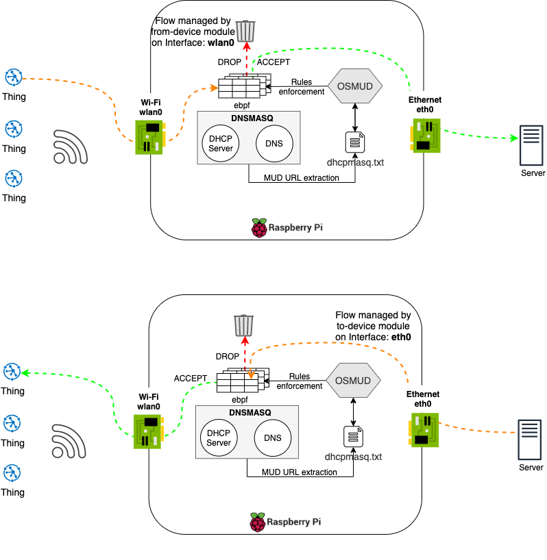

## Configure your linux machine as a router

The device hosting osMUD manager must be the router of your IoT network; thus, all the traffic should pass through it.

Configure iptables e.g.:
```bash
#!/bin/bash

# router_config.sh local_net_interface output_net_interface


echo 1 > /proc/sys/net/ipv4/ip_forward
iptables -A FORWARD -i $1 -o $2 -j ACCEPT
iptables -A FORWARD -i $2 -o $1 -m state --state ESTABLISHED,RELATED \
         -j ACCEPT
iptables -t nat -A POSTROUTING -o $2 -j MASQUERADE
```


Example of a machine ating as a router with ebpf firewall:




This version of osmud supports two linux firewalls: **iptables** and **eBPF**.

If you are using eBPF, you should notice that **our osmud version is designed to work with eBPF-IoT**, a customized system for securing Internet-of-Things smart homes.
